# UMA EVENT SCANNER

## Tiếng Việt

### Giới Thiệu
Uma Event Scanner là công cụ hỗ trợ nhận diện và phân tích sự kiện trong game Uma Musume Pretty Derby. Ứng dụng sử dụng OCR (Optical Character Recognition) để quét màn hình và nhận diện sự kiện đang diễn ra, sau đó hiển thị thông tin chi tiết về sự kiện đó, bao gồm các lựa chọn và tác động lên chỉ số.

### Hình Ảnh Minh Họa

#### Giao Diện Chính
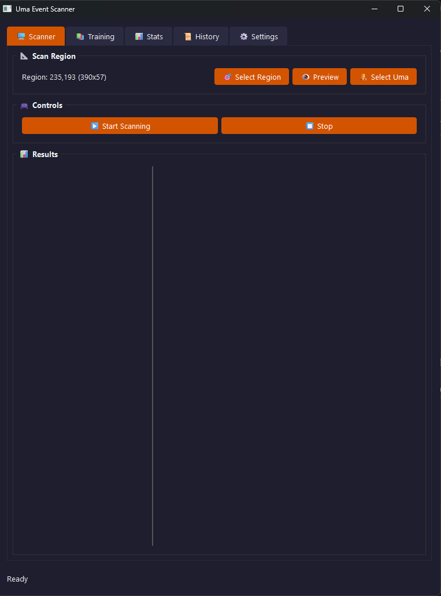

#### Chọn Vùng Quét
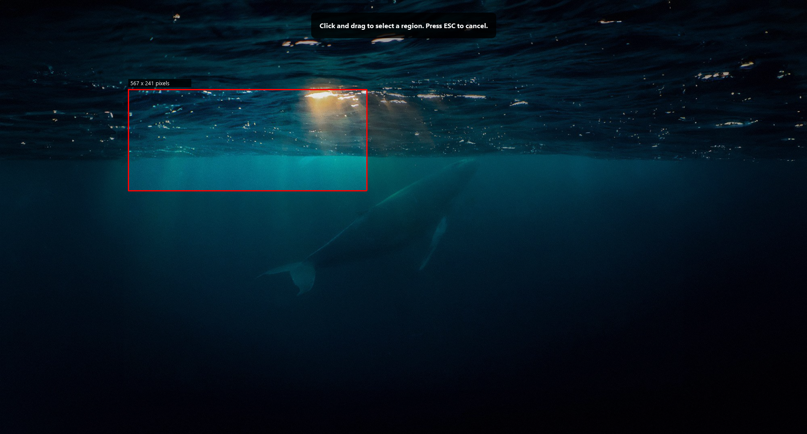

#### Nhận Diện Sự Kiện
##### Không Chọn Nhân Vật
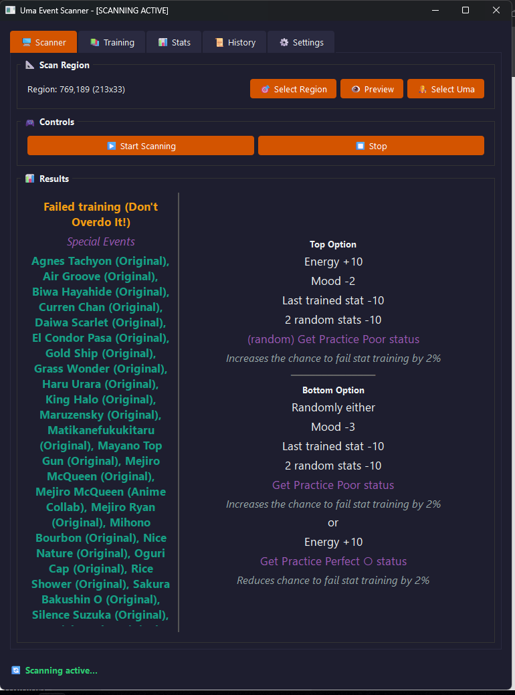

##### Đã Chọn Nhân Vật
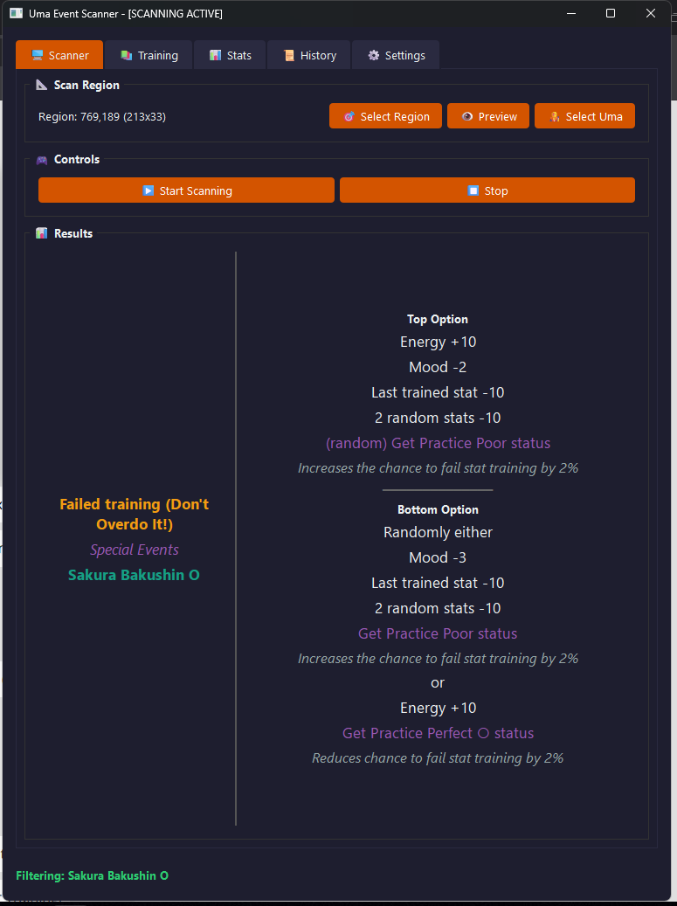

#### So Sánh Lựa Chọn Sự Kiện
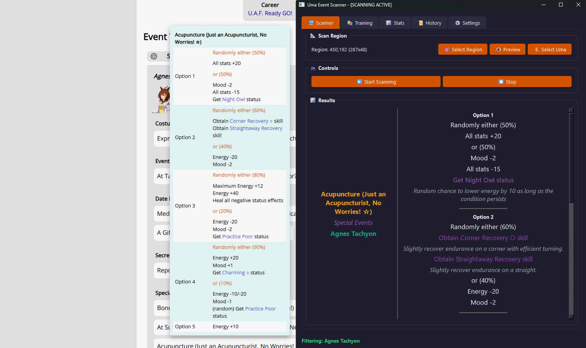

#### Danh Sách Sự Kiện Huấn Luyện
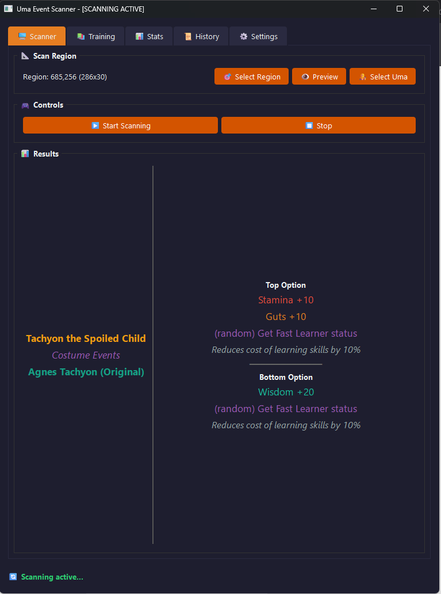

#### Giao Diện Cài Đặt
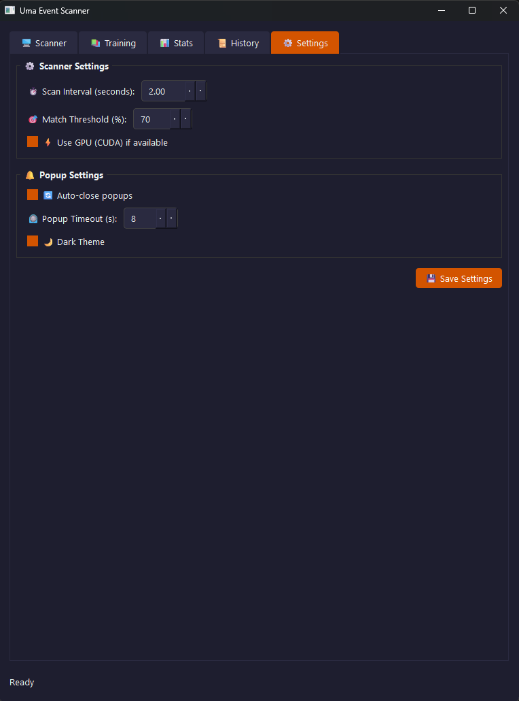

#### Chọn Nhân Vật
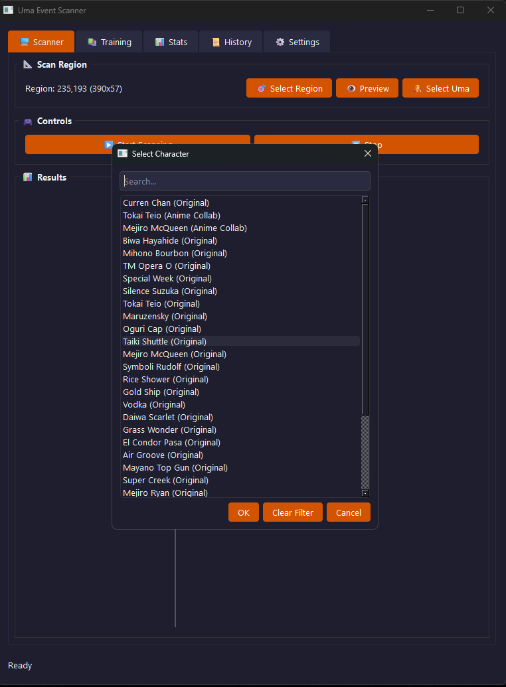

#### Giao Diện Tối
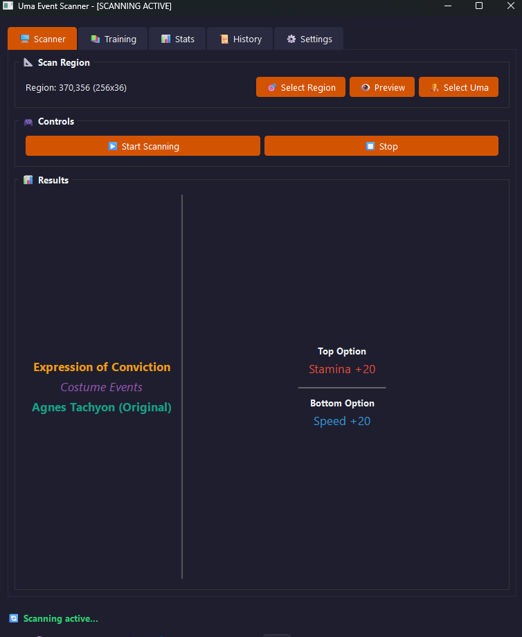

#### Giao Diện Sáng
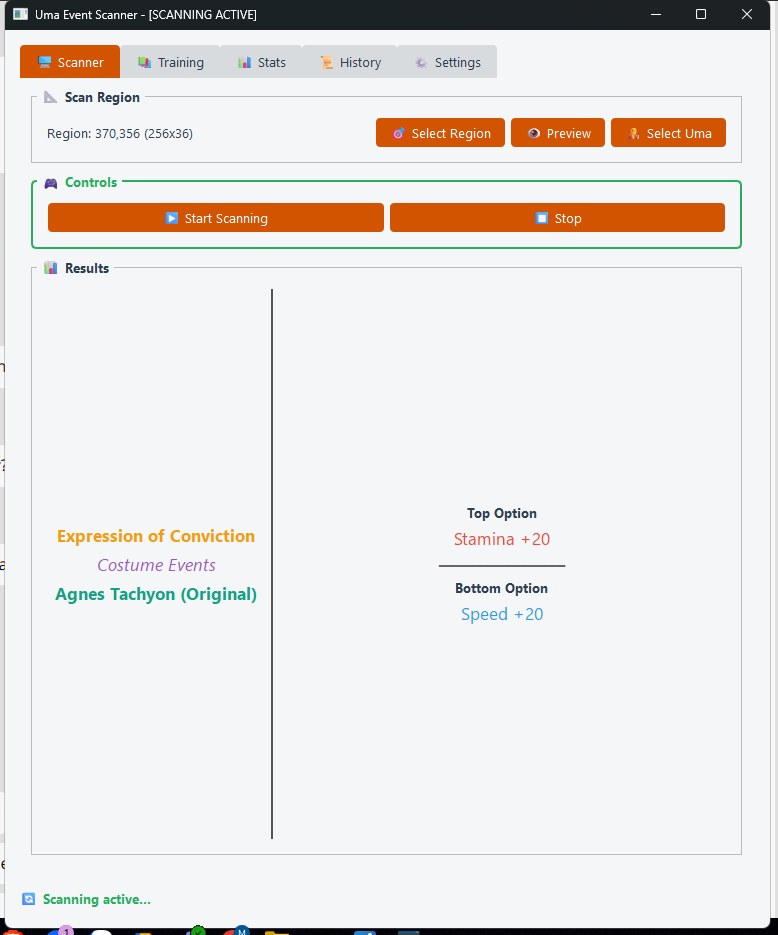

#### Màn Hình Game
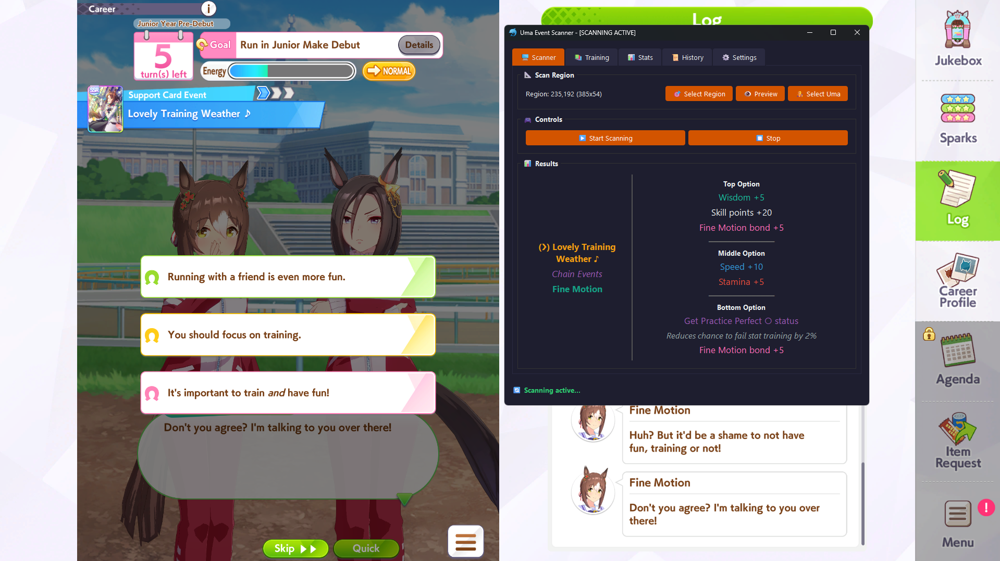

### Yêu Cầu Hệ Thống
- Python 3.8 trở lên
- Node.js (cần thiết cho chức năng scraping dữ liệu)
- Hệ điều hành Windows (đã được thử nghiệm trên Windows 10)

### Ngôn Ngữ và Công Nghệ
- Python
- PyQt6 (giao diện đồ họa)
- EasyOCR (nhận dạng ký tự quang học)
- OpenCV (xử lý hình ảnh)
- Node.js (cho công cụ scraping dữ liệu)

### Cách Cài Đặt
1. Clone repository này về máy tính của bạn
2. Khởi chạy file `UMA_PROJECT.bat`
3. Chọn tùy chọn "3. Install Dependencies" để cài đặt các thư viện cần thiết (cả Python và Node.js)

Hoặc bạn có thể cài đặt thủ công:
```
# Cài đặt Python dependencies
pip install -r requirements.txt

# Cài đặt Node.js dependencies cho chức năng scraping
cd scrape
npm install
```

**Lưu ý:** Tùy thuộc vào cấu hình Python của bạn, bạn có thể cần sử dụng `python -m pip` thay vì `pip` trực tiếp. Nếu gặp vấn đề khi cài đặt, hãy thử các lệnh sau:
```
python -m pip install -r requirements.txt
```
hoặc
```
python3 -m pip install -r requirements.txt
```
hoặc (đối với Windows với Python Launcher)
```
py -m pip install -r requirements.txt
```

### Cách Sử Dụng
1. Khởi chạy file `UMA_PROJECT.bat`
2. Chọn tùy chọn "1. Start Event Scanner" để mở ứng dụng

Hoặc bạn có thể khởi chạy trực tiếp:
```
python start_scanner.py
```

**Lưu ý:** Lệnh Python có thể khác nhau tùy thuộc vào hệ thống của bạn:
- `python` - Thông dụng trên hầu hết các hệ thống
- `python3` - Trên hệ thống có cả Python 2 và 3 
- `py` - Trên Windows với Python Launcher

Hãy sử dụng lệnh phù hợp với cài đặt Python trên máy tính của bạn.
3. Trong ứng dụng:
   - Chọn vùng quét (Select Region) trên màn hình của bạn nơi hiển thị sự kiện trong game
   - Chọn nhân vật Uma (nếu cần lọc sự kiện)
   - Nhấn "Start Scanning" để bắt đầu quét
   - Chương trình sẽ tự động nhận diện các sự kiện và hiển thị thông tin chi tiết

**Mẹo sử dụng giao diện:**
- Bạn có thể kéo dãn cửa sổ để hiển thị theo cách bạn muốn
- Vị trí và kích thước của cửa sổ sẽ được ghi nhớ cho lần sử dụng tiếp theo
- Có thể kéo thanh xám ở phần kết quả để ẩn phần Name/Type/Owner, giúp hiển thị phần Choices nhiều hơn
- Chế độ sáng (Light mode) chưa được điều chỉnh nhiều, nên sử dụng chế độ tối (Dark mode) để có trải nghiệm tốt nhất

### Tính Năng Chính
- Nhận diện sự kiện tự động thông qua OCR
- Phân tích và hiển thị các lựa chọn và tác động của sự kiện
- Lọc sự kiện theo nhân vật Uma
- Lịch sử các sự kiện đã quét
- Tùy chỉnh khu vực quét màn hình
- Giao diện trực quan với chế độ sáng/tối
- Hỗ trợ cài đặt dễ dàng qua file batch

### Tùy Chọn Cấu Hình
- Điều chỉnh tần suất quét
- Điều chỉnh ngưỡng nhận diện
- Bật/tắt sử dụng GPU để xử lý OCR

#### Chi Tiết File Cấu Hình
File `scanner_settings.json` chứa các cài đặt cho ứng dụng:
- `scan_interval`: Thời gian giữa các lần quét (giây)
- `match_threshold`: Ngưỡng tương đồng để nhận diện sự kiện (0-100)
- `theme`: Giao diện ("dark" hoặc "light")
- `use_gpu`: Bật/tắt sử dụng GPU cho OCR
- `ocr_language`: Ngôn ngữ sử dụng cho OCR
- `last_region`: Vùng quét màn hình cuối được sử dụng

### Thu Thập Dữ Liệu (Scraping)
Công cụ scraping được sử dụng để thu thập dữ liệu từ trang web [GameTora](https://gametora.com/umamusume). Các file scraping trong thư mục `scrape/` sẽ tự động truy cập trang web này và trích xuất thông tin về sự kiện, kỹ năng, và nhân vật.

#### Điều Chỉnh Tốc Độ Scraping
Bạn có thể điều chỉnh tốc độ scraping trong file `scrape/event-scrape.js` bằng cách thay đổi giá trị của biến `SPEED_FACTOR`:
```javascript
// Dòng 18: Điều chỉnh giá trị này để thay đổi tốc độ scraping
// Giá trị thấp hơn = nhanh hơn, giá trị cao hơn = chậm hơn
const SPEED_FACTOR = 0.3;
```

### Cấu Trúc Dự Án
- `data/`: Chứa dữ liệu về sự kiện, kỹ năng, nhân vật
- `event_scanner/`: Thư mục chính của ứng dụng
  - `core/`: Xử lý hình ảnh, OCR và cơ sở dữ liệu sự kiện
  - `ui/`: Giao diện người dùng PyQt6
  - `utils/`: Các tiện ích hỗ trợ
  - `resources/`: Tệp giao diện và tài nguyên
- `scrape/`: Công cụ scraping Node.js để cập nhật dữ liệu
- `run/`: Chứa các tệp batch để thực thi các chức năng khác nhau
- `tools/`: Công cụ bổ sung

### Xử Lý Sự Cố Thường Gặp
- **Lỗi "OCR engine not initialized"**: Đảm bảo rằng bạn đã cài đặt đầy đủ các thư viện cần thiết với `pip install -r requirements.txt`
- **Không thể nhận diện văn bản**: Hãy thử điều chỉnh khu vực quét và đảm bảo rằng văn bản rõ ràng, không bị chồng lấn với các yếu tố khác
- **Chương trình chạy chậm**: Nếu có GPU, hãy bật tùy chọn sử dụng GPU trong cài đặt
- **Lỗi khi cài đặt EasyOCR**: Cần đảm bảo cài đặt đầy đủ các thư viện phụ thuộc như Torch
- **Lỗi khi chạy scraper**: Đảm bảo đã cài đặt Node.js và các thư viện npm cần thiết bằng lệnh `npm install` trong thư mục `/scrape`

### Đóng Góp
Nếu bạn muốn đóng góp vào dự án, hãy:
1. Fork repository này
2. Tạo branch cho tính năng mới (`git checkout -b feature/amazing-feature`)
3. Commit các thay đổi (`git commit -m 'Add some amazing feature'`)
4. Push lên branch của bạn (`git push origin feature/amazing-feature`)
5. Mở Pull Request

### Giấy Phép
Dự án này được phân phối dưới giấy phép MIT. Xem file `LICENSE` để biết thêm thông tin.

### Credits
- Dữ liệu sự kiện được thu thập từ [GameTora](https://gametora.com/umamusume)
- Ứng dụng sử dụng EasyOCR để nhận dạng văn bản
- Giao diện được xây dựng với PyQt6

## English

### Introduction
Uma Event Scanner is a tool for recognizing and analyzing events in Uma Musume Pretty Derby game. The application uses OCR (Optical Character Recognition) to scan the screen and identify ongoing events, then displays detailed information about that event, including choices and their effects on stats.

### Screenshots

#### Main Interface


#### Region Selection


#### Event Detection
##### Without Character Filter


##### With Character Filter


#### Event Choices Comparison


#### Training Events List


#### Settings Interface


#### Character Selection


#### Dark Theme


#### Light Theme


#### Game Screenshot


### System Requirements
- Python 3.8 or higher
- Node.js (required for data scraping functionality)
- Windows operating system (tested on Windows 10)

### Languages and Technologies
- Python
- PyQt6 (graphical interface)
- EasyOCR (optical character recognition)
- OpenCV (image processing)
- Node.js (for data scraping tools)

### Installation
1. Clone this repository to your computer
2. Run the `UMA_PROJECT.bat` file
3. Select option "3. Install Dependencies" to install required libraries (both Python and Node.js)

Alternatively, you can manually install the dependencies:
```
# Install Python dependencies
pip install -r requirements.txt

# Install Node.js dependencies for scraping functionality
cd scrape
npm install
```

**Note:** Depending on your Python configuration, you may need to use `python -m pip` instead of `pip` directly. If you encounter issues during installation, try these commands:
```
python -m pip install -r requirements.txt
```
or
```
python3 -m pip install -r requirements.txt
```
or (for Windows with Python Launcher)
```
py -m pip install -r requirements.txt
```

### Usage
1. Run the `UMA_PROJECT.bat` file
2. Select option "1. Start Event Scanner" to open the application

Or you can run it directly:
```
python start_scanner.py
```

**Note:** Python commands may vary depending on your system:
- `python` - Common on most systems
- `python3` - On systems with both Python 2 and 3
- `py` - On Windows with Python Launcher

Use the appropriate command based on your Python installation.
3. In the application:
   - Select a scan region on your screen where game events are displayed
   - Choose Uma character (if you need to filter events)
   - Press "Start Scanning" to begin scanning
   - The program will automatically recognize events and display detailed information

**Interface tips:**
- You can resize the window to display content as you prefer
- The position and size of the window will be remembered for the next session
- You can drag the gray bar in the results section to hide the Name/Type/Owner area to show more of the Choices
- Light mode has not been fully optimized - for best experience, use Dark mode

### Main Features
- Automatic event recognition through OCR
- Analysis and display of event choices and effects
- Event filtering by Uma character
- History of scanned events
- Customizable screen scanning area
- Intuitive interface with light/dark modes
- Easy installation via batch files

### Configuration Options
- Adjust scanning frequency
- Adjust recognition threshold
- Enable/disable GPU use for OCR processing

#### Configuration File Details
The `scanner_settings.json` file contains settings for the application:
- `scan_interval`: Time between scans (seconds)
- `match_threshold`: Similarity threshold for event recognition (0-100)
- `theme`: Interface theme ("dark" or "light")
- `use_gpu`: Enable/disable GPU use for OCR
- `ocr_language`: Language used for OCR
- `last_region`: Last used screen scan area

### Data Collection (Scraping)
The scraping tools are used to collect data from the [GameTora](https://gametora.com/umamusume) website. The scraping files in the `scrape/` directory will automatically access this website and extract information about events, skills, and characters.

#### Adjusting Scraping Speed
You can adjust the scraping speed in the `scrape/event-scrape.js` file by changing the value of the `SPEED_FACTOR` variable:
```javascript
// Line 18: Adjust this value to change the scraping speed
// Lower value = faster, higher value = slower
const SPEED_FACTOR = 0.3;
```

### Project Structure
- `data/`: Contains data about events, skills, and characters
- `event_scanner/`: Main application directory
  - `core/`: Image processing, OCR, and event database
  - `ui/`: PyQt6 user interface
  - `utils/`: Helper utilities
  - `resources/`: Interface files and resources
- `scrape/`: Node.js scraping tools to update data
- `run/`: Contains batch files to execute various functions
- `tools/`: Additional utilities

### Troubleshooting
- **Error "OCR engine not initialized"**: Make sure you have installed all required libraries with `pip install -r requirements.txt`
- **Cannot recognize text**: Try adjusting the scan region and ensure that the text is clear, not overlapping with other elements
- **Program runs slowly**: If you have a GPU, enable the GPU option in settings
- **Error installing EasyOCR**: Make sure to install all dependencies like Torch
- **Error running scrapers**: Make sure you have installed Node.js and the required npm packages by running `npm install` in the `/scrape` directory

### Contributing
If you want to contribute to the project, please:
1. Fork this repository
2. Create a branch for the new feature (`git checkout -b feature/amazing-feature`)
3. Commit your changes (`git commit -m 'Add some amazing feature'`)
4. Push to your branch (`git push origin feature/amazing-feature`)
5. Open a Pull Request

### License
This project is distributed under the MIT License. See the `LICENSE` file for more information.

### Credits
- Event data is collected from [GameTora](https://gametora.com/umamusume)
- The application uses EasyOCR for text recognition
- The interface is built with PyQt6 